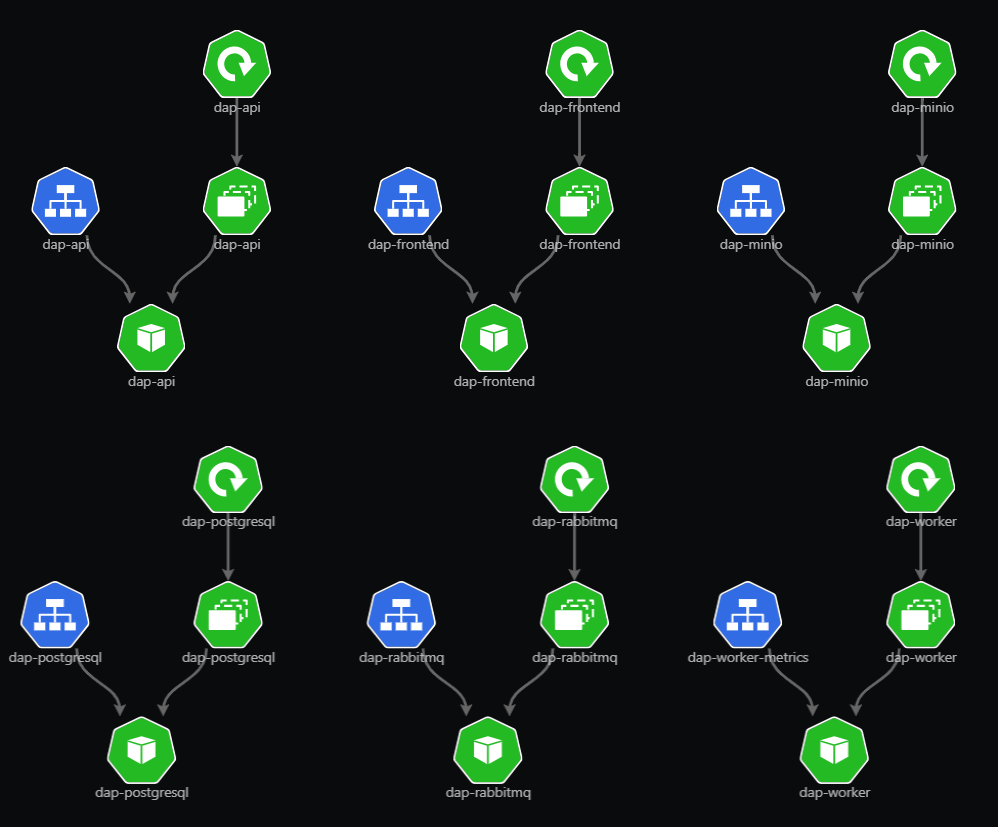
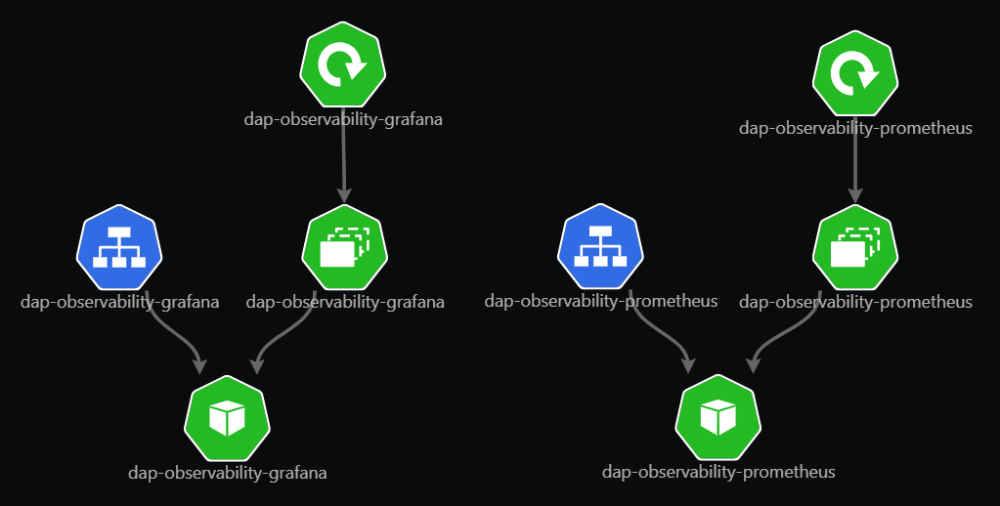

# Local Kubernetes With kind

Before following the steps below, make sure you have: `kind`, `helm`, `kubectl`.

This folder contains the local Helm-based deployment for the distributed audio pipeline.

It is split into two charts:

- `distributed-audio-pipeline`: the main application stack
- `observability`: optional Prometheus and Grafana for the same kind cluster

Stateful services use PVCs by default (PostgreSQL, RabbitMQ, MinIO, Prometheus, and Grafana). If needed for quick experiments, you can disable each PVC in chart values and fall back to `emptyDir`.

The API and worker images are pulled from DockerHub:

- `docker.io/matteo1610/distributed-audio-api:latest`
- `docker.io/matteo1610/distributed-audio-frontend:latest`
- `docker.io/matteo1610/distributed-audio-worker:latest`

The CI workflow publishes these images as multi-arch manifests (`linux/amd64` and `linux/arm64`) so kind clusters on Apple Silicon can pull them without platform mismatch errors.

The chart-local files are generated from the canonical sources in `db/` and `observability/` by running:

```bash
./scripts/sync_k8s_assets.sh
```

## Create the cluster

From `srcs/`:

```bash
kind create cluster --name audio-pipeline --config k8s/kind/kind-config.yaml
```

## Install the chart

From `srcs/`:

```bash
helm install dap k8s/distributed-audio-pipeline -f k8s/values-kind.yaml
```

## Optional observability

This chart installs Prometheus and Grafana into the same kind cluster. Install the app chart first, then install observability:

```bash
helm install dap-observability k8s/observability -f k8s/observability/values-kind.yaml
```

The default scrape targets expect the app release name to be `dap`:

- API: `dap-api:8000`
- Worker metrics: `dap-worker-metrics:9100`

If you use a different app release name, override `prometheus.scrapeTargets` in `values.yaml` or `values-kind.yaml`.

The Grafana datasource target is release-aware and points to the Prometheus service of the same observability Helm release, for example `dap-observability-prometheus:9090`.

## Exposed services

After both charts are installed, the exposed services are:

- API: http://localhost:8000
- Frontend: http://localhost:30517
- RabbitMQ management: http://localhost:15672
- MinIO console: http://localhost:9001 
- Worker metrics: http://localhost:9100/metrics
- Prometheus: http://localhost:9090 
- Grafana: http://localhost:3000 (default credentials: admin/admin)

If you did not install observability, the Prometheus and Grafana endpoints will not be available.

## Diagrams

Deployment diagrams for the two Helm charts are included below.

### distributed-audio-pipeline



### observability



## Cleanup

```bash
helm uninstall dap
helm uninstall dap-observability # if installed
kind delete cluster --name audio-pipeline
```
